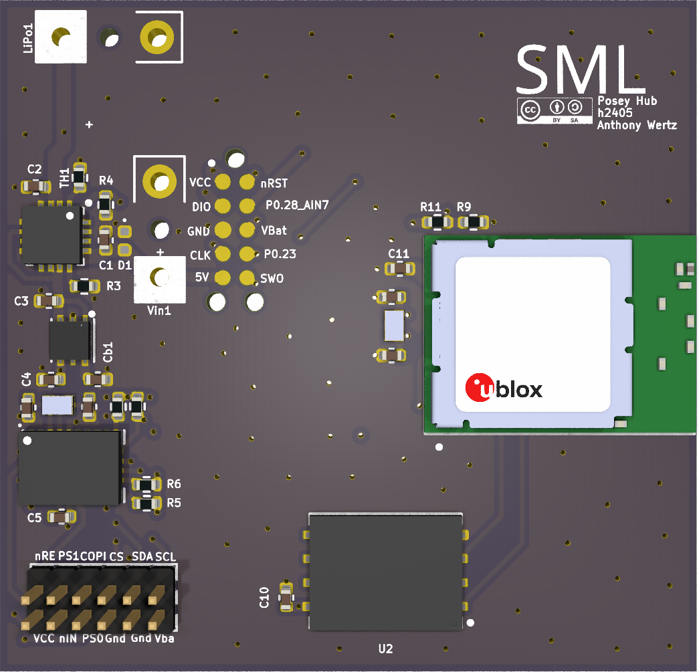

# Posey Hub Platform

This is a simple IMU hardware platform sized to fit in a waist-mounted device. The hub unit operates as both an IMU and a data collection device, connecting to other Posey devices and logging their data to on-board flash.

## Author

[Anthony Wertz](https://me.anthonywertz.com)

## License

[CC-BY-SA-4.0 license](license.md)
